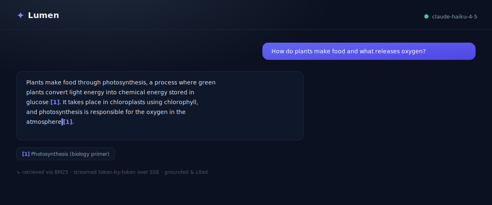

<div align="center">

# ✦ Lumen

**Chat with your documents — grounded, cited answers powered by Claude.**

Lumen is a compact retrieval-augmented generation (RAG) app: paste in documents, ask
questions, and get streamed answers that are grounded in your text and cite the exact
passages they came from — so you can trust them.

[Features](#features) · [Architecture](#architecture) · [Quick start](#quick-start) · [API](#api-reference) · [Design notes](#design-notes)


</div>

---

## Preview

<div align="center">



_The answer streams in token-by-token, then cites the exact source it was grounded in._

</div>

<!-- The animation above is a self-contained SVG. For a real screen capture, record the
     running app (e.g. with ScreenToGif), save it as docs/demo.gif, and swap the src. -->

---

## Why this project

Retrieval-augmented generation is the dominant pattern for putting LLMs to work on
private data. Lumen implements the full loop end-to-end in a small, readable codebase:

**ingest → chunk → retrieve → ground → stream a cited answer.**

It is intentionally small — one afternoon's worth of code — but it demonstrates the parts
that matter in production LLM engineering: token-by-token streaming over SSE, strict
source-grounding to curb hallucination, a typed API contract, a retriever hidden behind
an interface so it can be swapped, and tests + CI.

## Features

- **📎 Grounded answers with citations.** Every claim is tagged with a `[n]` marker that
  maps to the retrieved passage it came from. Hover a citation to see the source snippet.
- **⚡ Real-time streaming.** Answers stream token-by-token from Claude over Server-Sent
  Events — no waiting for the full response.
- **🔍 Pluggable retrieval.** Ships with three interchangeable strategies behind one
  interface: **BM25** (default — lexical, offline, zero downloads), **semantic** (dense
  embeddings, matches by meaning), and **hybrid** (Reciprocal Rank Fusion of both). Switch
  with one env var.
- **🧯 Hallucination guardrails.** The model is instructed to answer *only* from the
  supplied sources and to say so when the documents don't cover a question.
- **🧱 Typed end-to-end.** Pydantic v2 on the backend, TypeScript + Zod-style contracts on
  the frontend.
- **🩺 Graceful degradation.** No API key configured? The UI stays usable and tells you why.
- **✅ Tested + CI.** Pytest for the backend, type-checked build for the frontend, GitHub
  Actions on every push.

## Architecture

```
┌─────────────────────────────┐         ┌──────────────────────────────────────┐
│  React + Vite + Tailwind     │         │  FastAPI (async)                      │
│                              │         │                                       │
│  DocumentPanel ── REST ──────┼────────▶│  /api/documents   (CRUD)              │
│  ChatPanel ───── SSE POST ───┼────────▶│  /api/chat        (streaming RAG)     │
│    · token-by-token render   │◀────────┤     1. retrieve top-k chunks (BM25)   │
│    · hover-to-verify sources │  events │     2. build grounded prompt          │
└─────────────────────────────┘         │     3. stream answer from Claude ─────┼──▶ Anthropic API
                                         │                                       │
                                         │  DocumentStore ── BM25Retriever       │
                                         │    (in-memory, interface-backed)      │
                                         └──────────────────────────────────────┘
```

### How a question flows

1. The browser `POST`s the question to `/api/chat` and reads a Server-Sent Event stream.
2. The backend runs BM25 over the indexed chunks and selects the top-`k` most relevant.
3. It emits a `sources` event (the citations) immediately, so the UI can render them.
4. It builds a prompt that hands Claude the numbered sources and strict grounding rules,
   then relays the model's output as `token` events as they arrive.
5. A `done` (or `error`) event closes the stream.

## Tech stack

| Layer        | Choices                                                                  |
| ------------ | ------------------------------------------------------------------------ |
| Backend      | FastAPI · Pydantic v2 · `pydantic-settings` · `sse-starlette`            |
| LLM          | Anthropic Claude (`claude-opus-4-8` by default) via the official SDK     |
| Retrieval    | `rank-bm25` lexical · optional `fastembed` semantic/hybrid (RRF)          |
| Frontend     | React 19 · Vite 6 · TypeScript · Tailwind v4 · TanStack Query            |
| Tooling      | Ruff · Pytest · GitHub Actions · Docker Compose                          |

## Quick start

### Prerequisites

- Python 3.11+ and Node 20+
- An [Anthropic API key](https://console.anthropic.com/) (the app runs without one, but
  can't generate answers until you add it)

### 1 · Backend

```bash
cd backend
python -m venv .venv
source .venv/Scripts/activate      # Windows Git Bash — use `source .venv/bin/activate` on macOS/Linux
pip install -e ".[dev]"

cp .env.example .env                # then paste your key into LUMEN_ANTHROPIC_API_KEY
uvicorn app.main:app --reload       # http://127.0.0.1:8000  (docs at /docs)
```

### 2 · Frontend

```bash
cd frontend
npm install
npm run dev                         # http://localhost:5173  (proxies /api → :8000)
```

Open http://localhost:5173, click **Load sample documents**, and ask something like
*"How do plants make food?"* or *"What made Roman concrete special?"*.

### Run it with Docker

```bash
export LUMEN_ANTHROPIC_API_KEY=sk-ant-...
docker compose up --build           # UI on http://localhost:5173
```

## API reference

| Method   | Path                   | Description                                        |
| -------- | ---------------------- | -------------------------------------------------- |
| `GET`    | `/api/health`          | Service status, configured model, document count.  |
| `GET`    | `/api/documents`       | List indexed documents and total chunk count.      |
| `POST`   | `/api/documents`       | Index a `{ title, content }` document.             |
| `DELETE` | `/api/documents/{id}`  | Remove a document and re-index.                    |
| `POST`   | `/api/chat`            | Ask a question; returns an SSE stream (see below). |

**`POST /api/chat`** streams these events:

| Event     | Payload                                  | Meaning                          |
| --------- | ---------------------------------------- | -------------------------------- |
| `sources` | `{ citations: Citation[] }`              | Retrieved passages (sent first). |
| `token`   | `{ text: string }`                       | An incremental slice of answer.  |
| `error`   | `{ message: string }`                    | A terminal, human-readable error.|
| `done`    | `{}`                                     | End of stream.                   |

Interactive OpenAPI docs are served at **`/docs`**.

## Testing

```bash
# Backend — unit + API tests
cd backend && pytest

# Backend — lint
ruff check .

# Frontend — type-check + production build
cd frontend && npm run build
```

## Project structure

```
lumen/
├── backend/
│   ├── app/
│   │   ├── main.py          # app factory, CORS, health, router wiring
│   │   ├── config.py        # env-driven settings (pydantic-settings)
│   │   ├── schemas.py       # typed request/response models
│   │   ├── retrieval.py     # chunking + BM25 retriever (behind an interface)
│   │   ├── store.py         # in-memory document store + reindex
│   │   ├── llm.py           # Claude streaming + grounding prompt
│   │   └── routes/          # documents (CRUD) + chat (SSE)
│   └── tests/               # pytest: retrieval logic + API contract
└── frontend/
    └── src/
        ├── lib/             # api client, SSE parser, types, sample docs
        └── components/      # DocumentPanel + ChatPanel
```

## Design notes

- **Retrieval behind an interface.** All strategies implement one small `rebuild` / `search`
  `Retriever` protocol, so the routes and store never change. BM25 keeps the default offline
  and instant; `semantic` and `hybrid` add embedding-based matching (`fastembed`, ONNX/CPU,
  no torch) and load the model lazily only when selected. Set `LUMEN_RETRIEVER=hybrid` after
  `pip install ".[semantic]"`.
- **Grounding over recall.** The system prompt forbids outside knowledge and requires
  citations. On a tiny corpus BM25's IDF term can collapse to zero, so the retriever falls
  back to raw term-overlap ranking — a small but real robustness fix.
- **Streaming via POST.** `EventSource` only supports GET, so the client streams the answer
  by reading the `fetch` response body and parsing SSE frames by hand
  (`frontend/src/lib/chat.ts`).
- **Stateless & swappable storage.** The store is in-memory for zero-setup demoing; it is
  isolated so a database-backed implementation drops in without touching the API.

## License

[MIT](LICENSE) © 2026 Oleksandr Shulenin
